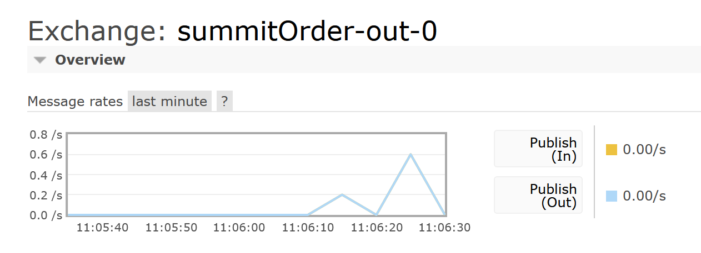
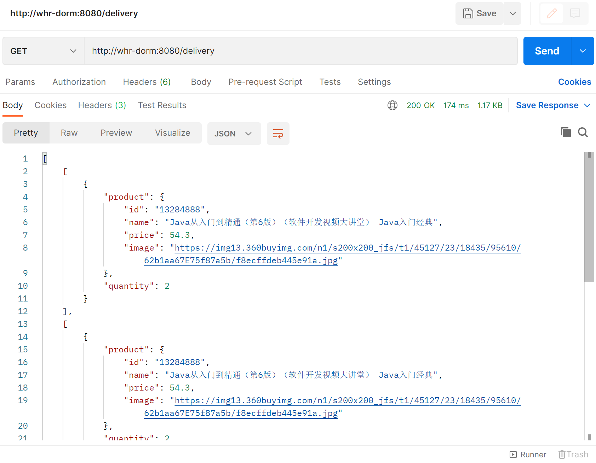

# Order Service

Order Service 实现了以下 API：
- `/order`：类型为 `POST`，作用为确认购物车的商品信息并提交该订单。

Order Serive 通过 HTTP 请求，从 Cart Service 中获取购物车的信息

# Delivery Service

Order Service 实现了以下 API：
- `/delivery`：类型为 `GET`，作用为查看已经提交的订单信息。

Delivery Serive 通过 RabbitMQ 的消息机制，获取订单的信息并进行存储。

# 消息机制

使用名为 `summitOrder-out-0` 的 exchange。

由于用户提交订单是异步操作，因此示例代码中默认的每秒钟发送一次消息的机制并不适用于 WebPOS。因此在 `pos-order` 中使用了 `streamBridge`，以异步的发送消息。

# 实验结果

连续发送了 4 个相同的订单，RabbitMQ 界面的统计图如下：

Postman 进行 `/delivery` 的 `GET` 请求，结果如下：

